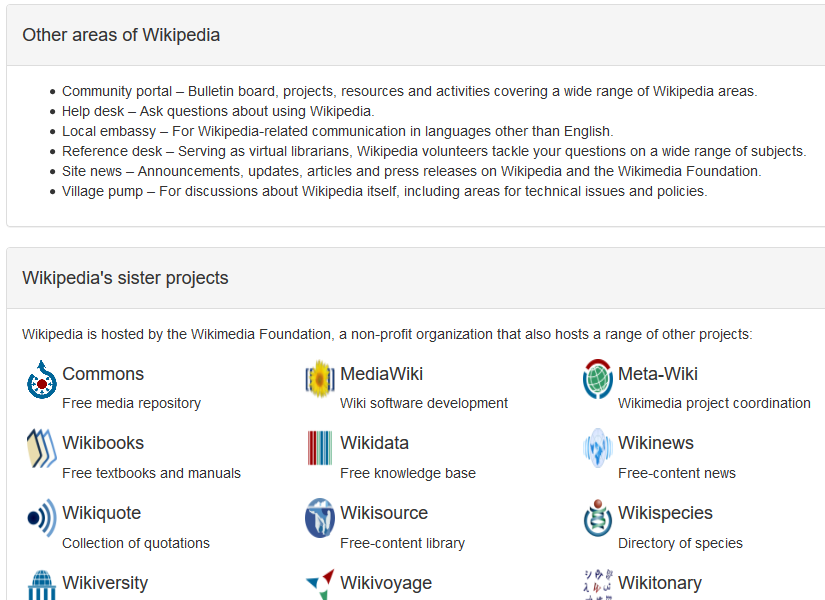

# _Wikipedia Rebuild_

#### _Replicating UI Exercise for Epicodus, 01.10.2020_

#### By _**Tiffany Siu and Neha Doodi**_

## Description

This site was an exercise in practicing using CSS bootstrap and HTML to recreate the front page of wikipedia.  It does not have any working links or functionality, it is just a visual copy of the site as it looked like on the day of creation.  It uses the different divs, spans, floats, and other layout and formatting tools available in bootstrap to style the page to be as close to the real site as possible with our current skills.

## Setup/Installation Requirements

### Requirements to Run
* _Web Browser_

### Other Resources Used
* _Bootstrap_

### Instructions
_This page may be viewed by cloning the [repository](https://github.com/TSiu88/wikipedia-rebuild.git) from my [GitHub page](https://github.com/TSiu88) and opening the **index.html** file in any web browser._

## Technologies Used

* _HTML_
* _CSS_
* _Bootstrap_
* _Markdown_

## Notable Features
_This program was created completely through HTML and CSS after learning how to use Bootstrap for styling a site.  This was done at the end of one week of learning HTML and CSS from class and on the same day that using Bootstrap was introduced._

## Specifications

* _Have a sidebar on the entire left side of the page with the logo and links to different sections of wikipedia_
  * _Example Input: style with column on left side_
  * _Example Output: sidebar with logo and dummy links_
* _Have an account and login section the is aligned to the right side_
  * _Example Input: style with line of text aligned to the right_
  * _Example Output: account/login section_
* _Have tabs above the welcome title card with some aligned left and some aligned right_
  * _Example Input: style tabs to be on right or left sides_
  * _Example Output: tabs with dummy links_
* _Have welcome title card and list of sections to browse as links_
  * _Example Input: style welcome title card with welcome on left and links of sections on the right_
  * _Example Output: welcome title card aligned on left, unordered list of sections on right_
* _Have four main sections of featured articles with left in green and right in blue_
  * _Example Input: style panels to look like the original site_
  * _Example Output: four panels with pictures, text, unordered lists, and links_
* _Have featured picture section with large picture and text on bottom_
  * _Example Input: style panel with picture on left and text on right_
  * _Example Output: panel with picture, text, and links_
* _Have panels for other areas of wikipedia, sister projects, and languages that looks similar in formatting to original site_
  * _Example Input: style panels with text and pictures_
  * _Example Output: formatted panels and copied pictures and languages to mimic original site_
* _Have license and copyright information text on the bottom of the site_
  * _Example Input: style text for license and copyright to fit in available space_
  * _Example Output: license and copyright information_

## Screenshots

_Here is a snippet of what the top of the page looks like:_

_Here is another snippet of what more of the page looks like:_

## Known Bugs

_The large chunks of text are missing dummy links. Also the tabs at the top of the page can wrap strangly if the browser window is too small._

## Support and contact details

_If there are any question or concerns please contact me at my [email](mailto:tsiu88@gmail.com). Thank you._

### License

*This software is licensed under the MIT license*

Copyright (c) 2020 **_Tiffany Siu, Neha Doodi_**
